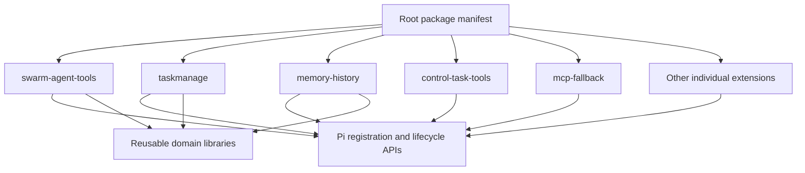

# Independent extensions: migration record

Status: implementation in `refactor/independent-extensions`, not deployed to personal settings.

## Shape

There is one folder per extension, no numeric layers and no swarm-runtime umbrella.
The root manifest remains explicit, preserving the original selection and order
where possible. `index.ts` is a small toggle-aware entrypoint; `extension.ts`
is the implementation. The gate is retained to preserve Ctrl+N behavior, not
presented as elimination of every runtime helper.

## Actual ownership changes

- Daemon client, task/run tools and daemon_status now belong to control-task-tools.
- MCP startup/config/discovery and legacy /swarm-runtime diagnostic belong to mcp-fallback.
- Agent, AgentControl and legacy agent tools now share one manager owned by swarm-agent-tools.
- Prompt registration is no longer duplicated by an umbrella extension.
- Vault owns both its tool and command. History no longer implicitly enables vault.
- The unused umbrella Policy object is removed; this does not change actual authorization gates.
- Agent execution reads the actual fifth-argument Pi tool context.

## Parity evidence and limits

The pre-move real-host baseline is 53 entries, 55 tools, 34 commands.
After moves, exact per-entry registrations matched (ignoring paths).
After ownership extraction, aggregate tool names/descriptions/schemas, commands,
shortcuts, flags and renderers still match. Lifecycle counts intentionally differ:
one duplicated prompt/correction registration set is gone; daemon shutdown is
now separately owned. Equal counts are not proof of execution parity.

Build and actual-host package loading pass. Loader ON/OFF/ON and narrow actual
session toggle/reload pass. Final full-suite run with TMPDIR=/private/tmp:
846 passed, 7 failed, 7 skipped. Original checkout under the same environment:
845 passed, 8 failed, 7 skipped. Failure-name comparison is recorded in the
worktree artifacts; the worktree introduces no additional failing test names.
Forty focused owner tests pass. Earlier equal failure counts were NOT sufficient:
a new helper-contract regression was found by comparing names and then fixed.
No live model calls, daemon server, remote MCP, paid research, or real credential
mutation were exercised. This is NOT complete end-to-end 1:1 certification.

## Each enabled extension

This inventory is from Pi's actual loaded registrations, not inferred filenames.
A no-tool entry can still own commands/hooks. The transport layer's dynamic
registration behavior is not fully represented by factory-time inventory.

| Extension folder | Tools | Commands | Lifecycle events |
| --- | --- | --- | --- |
| `trebol-toggle` | — | /trebol-toggle | session_shutdown, session_start |
| `pi-tmux-resurrection` | — | — | session_start |
| `cache-telemetry` | — | /cache | after_provider_response, before_provider_request |
| `swarm-update` | — | /trebol-update | session_shutdown, session_start |
| `bootstrap` | bootstrap | /bootstrap, /mem | agent_settled, before_agent_start, input, message_end, message_update, session_before_compact, session_shutdown, session_start, tool_call |
| `hooks` | — | /hooks | session_start |
| `mcp-fallback` | — | /swarm-mcp, /swarm-runtime | session_shutdown, session_start |
| `swarm-transport-parity` | — | — | before_agent_start, before_provider_request, context, model_select, session_start |
| `autogenskills` | Skill, SkillManage | /curator, /swarm-autogen | agent_settled, before_agent_start, input, message_end, message_update, session_before_compact, session_compact, session_shutdown, session_start, session_switch, tool_call, tool_result, turn_end |
| `mermaid-response` | — | — | input, message_end, session_start, session_switch, turn_end |
| `prompt-context-configure` | — | /configure | — |
| `swarm-plan-mode` | enter_plan_mode, exit_plan_mode | /plan-mode | session_start |
| `swarm-prompt` | — | — | agent_settled, before_agent_start, input, message_end, message_update, session_before_compact, session_shutdown, session_start |
| `swarm-auto` | — | /auto | agent_end, agent_settled, agent_start, before_agent_start, input, session_before_compact, session_before_fork, session_before_switch, session_before_tree, session_shutdown, session_start |
| `swarm-skills` | skill_view, skills_list | /skill, /swarm-skills | session_start |
| `swarm-thinking` | — | /swarm-thinking | — |
| `system-inspector` | — | /system | before_agent_start, session_start |
| `system-prompts` | — | /sp | — |
| `swarm-context` | context_delete, context_index, context_inspect, context_outline, context_read, context_reindex, context_remember, context_search | /swarm-context | session_shutdown, session_start |
| `swarm-disk-hooks` | — | /swarm-disk-hooks | agent_settled, before_agent_start, input, message_end, message_update, session_before_compact, session_shutdown, session_start, tool_call, tool_result |
| `project-init` | project_init | /init | agent_settled, input, message_end, message_update, session_before_compact, session_shutdown, session_start, tool_call |
| `annoyed` | annoyed | /annoyed | session_shutdown |
| `control-task-tools` | daemon_status, goal_get, run_cancel, run_create, run_get, run_status, task_cancel, task_create, task_get, task_status | — | session_shutdown |
| `history-search` | history_search | — | session_start |
| `ask-user` | ask_user_question | — | — |
| `research-tools` | browser_get_page, deepwiki, web_fetch | — | — |
| `swarm-monitor` | monitor_agent | — | agent_end, agent_settled, agent_start, session_before_compact, session_shutdown, session_start |
| `swarm-websearch` | — | /swarm-websearch | session_shutdown, session_start |
| `swarm-goal` | scheduler | /goal, /loop | agent_end, agent_settled, agent_start, session_before_compact, session_shutdown, session_start |
| `swarm-agent-tools` | Agent, AgentControl, BackgroundTask, Delegate, DelegateOutput, multi_agent_wait, Subagent, SubagentOutput, TaskOutput, wait_for_agent | — | session_shutdown, session_start |
| `swarm-background-bash` | Bash, ReadBackgroundCommand | — | agent_end, agent_settled, agent_start, session_before_compact, session_start |
| `swarm-bash` | bash | — | — |
| `swarm-fs-tools` | apply_patch, Read, Undo | — | session_start |
| `swarm-history-vault-tools` | HistoryGet, HistorySearch | — | session_start |
| `taskmanage` | TaskManage | /tasks | agent_settled, before_agent_start, input, message_end, message_update, session_before_compact, session_shutdown, session_start, shutdown, tool_call, tool_execution_end, tool_execution_update, tool_result, turn_end, turn_start |
| `vault` | vault | /vault | — |
| `memory-history` | memory_history | /memory-promote | before_agent_start, session_shutdown, session_start |
| `task-candidate-capture` | — | — | session_start, tool_result |
| `knowledge-enrichment` | — | /memory-capture | agent_end, agent_settled, agent_start, session_before_compact, session_shutdown, session_start |
| `candidate-memory-review` | — | /memory-review | agent_end, agent_settled, agent_start, session_before_compact, session_before_fork, session_before_switch, session_shutdown, session_start, session_switch |
| `jev-knowledge-audit` | — | — | agent_end, agent_settled, agent_start, before_agent_start, context, input, message_end, session_before_compact, session_before_fork, session_before_switch, session_compact, session_fork, session_shutdown, session_start, session_switch, tool_result, turn_end, turn_start |
| `memory-maintenance` | — | — | agent_end, agent_settled, agent_start, context, input, session_before_compact, session_before_fork, session_before_switch, session_compact, session_fork, session_shutdown, session_start, session_switch, tool_call, tool_result, turn_end, turn_start |
| `swarm-conversation-metadata` | — | — | agent_end, agent_settled, agent_start, session_before_compact, session_start |
| `control-panel` | — | — | — |
| `supervisor` | — | /supervisor | session_shutdown, session_start, turn_end |
| `conversation-metrics` | — | /metrics | agent_end, agent_settled, agent_start, message_end, session_before_compact, session_shutdown, session_start |
| `clover-startup` | — | — | session_shutdown, session_start |
| `swarm-themes` | — | — | session_start |
| `swarm-tools-status` | — | /swarm-tools | — |
| `swarm-btw` | — | /btw | — |
| `swarm-image-paste` | — | — | — |
| `green-chat-input` | — | — | session_start |

## Settings migration

Old exact filters reference `.trebol-guards` paths and will not match new paths.
Translate them through tools/repo/extension-moves.json before activating this
worktree. Do not register it globally alongside the original checkout. No user
settings were modified during this worktree refactor.

## Deliberately unfinished architecture

The synthetic settlement helper, manual bootstrap dispatcher, process-global
hook registries, transport schema overlays and host prototype adapters remain.
Changing those is behavior migration, not a file move. Native Pi settlement and
executeTool require dedicated lifecycle/policy regression coverage before removal.
The remaining `.pi/lib` helpers and domain workspaces stay shared; copying them
into every extension would create multiple mutable owners rather than independence.

## Continued verification

- Every one of the 53 enabled manifest entries loads alone in a fresh process:
  `node tools/install/check-load.mjs --extension extensions/<name>/index.ts`.
  This proves independent factory loading, not that optional integrations operate
  without their dependencies or that every lifecycle handler is safe alone.
- Fixed relocation bugs: updater package-version lookup and system inspector
  checkout/root-manifest discovery. Focused regression tests cover both.
- Added preview-only `tools/install/migrate-extension-paths.mjs <settings.json>`.
  It reports exact filter replacements without writing settings or printing
  unrelated fields. Legacy wildcard/directory filters require manual review.
- Fixed two platform-sensitive test assertions without changing their contracts:
  prompt golden now validates then masks the OS; skill body sentinel no longer
  accidentally matches macOS `/private` paths in valid skill locations.
- Latest build and surface parity pass; actual-session toggle/reload passes.
  Full suite with TMPDIR=/private/tmp: 850 passed, 5 failed, 7 skipped (862).
  All five failures are existing macOS background-shell output/status cases.
- Attempted replacing BSD script with direct pipes; reverted because doing so
  breaks buffered-runtime streaming. Do not hide this tradeoff with output stripping.
- Real scripted-provider task-enforcement smoke fails: the first attempted write
  returns `Operation aborted`, then the session ends before recovery. No fixture
  file is written. This exposes a lifecycle/recovery verification blocker, not
  proof that task enforcement is bypassed. The smoke also needs its task-create
  fixture updated for required questions. No success is claimed for that flow.

## Actual installation and headless recovery

Ran real `pi install /Users/swarm/Work/Clover/trebol-extensions` from an isolated
workspace with an isolated PI_CODING_AGENT_DIR. `pi list` resolves the worktree;
loading that installed configuration yields 53 extensions and zero errors.
Normal personal registration was not switched: macOS shell failures remain.

Fixed headless recovery: speculative message-stream abort now applies only to
TUI mode. Print/JSON/RPC denials retain the authoritative tool_call block and
normal failed-tool-result recovery. Real local scripted-provider smoke now proves
blocked apply_patch -> TaskManage create (with required questions) -> successful
apply_patch, producing exactly `written\n` in an isolated fixture. No external
provider or real project mutation is involved. A focused test protects the
non-TUI no-abort/final-block behavior. TUI speculative recovery remains separate
and is not certified by this smoke.

Build and public-surface parity pass. Full suite before the added focused test:
850 passed, five existing macOS shell failures, seven skipped. Attempted BSD
script stdin/status workaround failed and was reverted, not shipped.

## Cleanup validation (supersedes earlier failing-suite results)

- Full suite with canonical macOS TMPDIR=/private/tmp: **853 passed, seven skipped,
  zero failures** (142 passing test files). Build passes; public surface still
  matches 55 tools / 34 commands. Loader ON/OFF/ON and real-session toggle pass.
- Replaced BSD `script` on macOS with an optional Python output-only PTY helper
  `.pi/lib/tools/pty-runner.py`. It preserves child signal status, does not echo
  EOF input, streams output, bounds descendant-held PTY drain to 200ms, and keeps
  child processes in the Node-owned cancellation process group. Python absent:
  existing stdbuf/direct fallback remains, with reduced buffering guarantees.
  All 16 shell tests pass. Linux retains util-linux script; Windows unchanged.
- Removed timer-derived settlement and its global subscriber/bridge structures.
  `onAgentSettled` now waits exclusively for native Pi settlement, retaining only
  the final agent_end payload for existing consumers. Shutdown clears it; errors
  reach Pi rather than being swallowed. Two test fakes were fixed to support
  multiple handlers like the real host, not overwrite shutdown callbacks.
- Bootstrap tool-context handoffs use native `ctx.executeTool` and honor host
  errors without falling back around a denial. Lifecycle supervisor calls lack
  this context and retain the explicit compatibility dispatcher. Its global map
  and hook dispatch are not claimed removed.
- Remaining architecture debt: move auto/goal/correction continuation decisions
  to agent_before_settle, replace lifecycle supervisor dispatch with a supported
  execution seam, and replace optional host prototype adapters. These require
  further behavior migration; current tests do not prove those designs ideal.
- Actual install was tested only in isolated settings; no automatic personal
  cutover, filter rewrite, credential relocation or Git merge performed.

## Native continuation boundaries

Auto and goal continuation now return custom-message drafts plus `continue:true`
from `agent_before_settle`; neither starts a turn from final `agent_settled`.
They preserve preceding handlers' drafts and suppress continuation for aborted/
failed runs, existing continuation requests, or pending input. Auto retains its
progress-marker/dedup checks and no longer owns a delayed wake timer. Goal checks
retain generation/revision cancellation; independent scheduler wakeups remain.

Real Pi + loopback scripted-provider validation:
`node tools/e2e/auto-boundary.mjs` proves exactly two requests for an initial
response with continuation marker, then final settlement with no delayed wake,
followed by /auto off. No external credentials/provider calls. This caught an
incorrect initial canContinue guard: Pi validates continuation AFTER committing
our custom-message draft, so a false pre-draft canContinue is not a denial.

Full suite: 855 passed, seven skipped, zero failures; build/public-surface parity,
actual-session toggle and task-enforcement recovery smoke pass. TUI speculative
hook correction, supervisor lifecycle compatibility dispatch and optional host
prototype adapters remain explicitly separate unfinished compatibility seams.

## Correction and compatibility ownership cleanup

Removed speculative streaming-abort correction in ALL modes, including TUI.
Normal authoritative tool_call gates still deny actions and provide same-step
feedback, with bounded repeat escalation. No correction preview registry,
terminal-input interception, or post-settlement correction wake remains. This
intentionally changes early interruption timing, not execution authorization.

Lifecycle handoff tool registrations are now scoped by actual session ID, with
owner-checked replacement and shutdown disposal. Bootstrap's native executeTool
path is unchanged. The supervisor fallback still dispatches Trebol's own hook
registry, not every third-party native hook: this limitation is not solved by
session scoping and is not described as full native execution parity.

Bootstrap native-settings compatibility adapter now validates its host shape,
removes injected rows from tracked lists at disposal, and restores the original
render method when it still owns the patch. It does not overwrite a later
third-party patch. Ctrl+N's shortcut prototype adapter remains because the
supported shortcut context does not expose reload; the actual-host toggle test
continues to cover it. No host files are modified.

Latest full run before one additional passing session-isolation test: 858 passed,
seven skipped, zero failed. Build, public surface, real auto-boundary, real toggle,
and scripted-provider task-recovery checks pass. Focused settings disposal and
session-scoped handoff tests pass. No normal-install cutover or merge performed.

## Session-owned hooks and shortcut adapter

Fallback hook dispatch now requires a real session ID, preserves distinct
same-group/event registrations, and selects only live handlers belonging to
that session. One lifecycle owner per ExtensionAPI attaches/removes its handler
set on start/shutdown. This fixes the old mismatch where native Pi retained
multiple handlers but manual dispatch replaced all except the last. It also
prevents disabled/reloaded extensions' handlers remaining in fallback dispatch.
It does NOT turn this into the native Pi pipeline or include third-party hooks.

Ctrl+N compatibility uses owner leases. Last release restores its original
getShortcuts method only if it still owns the patch; later third-party patches
are never overwritten. Session restart reacquires the adapter. Actual-host
ON/OFF/ON reload remains tested. A host patch is still necessary for shortcut
reload in this Pi version; no unsupported claim of complete adapter removal.

Validation: 863 tests passed, seven skipped, no failures; build and 55-tool /
34-command public-surface parity pass. Actual Pi toggle, native auto continuation,
and blocked-write/task-create/successful-write recovery all pass. Normal personal
settings remain untouched and the worktree is not merged.
