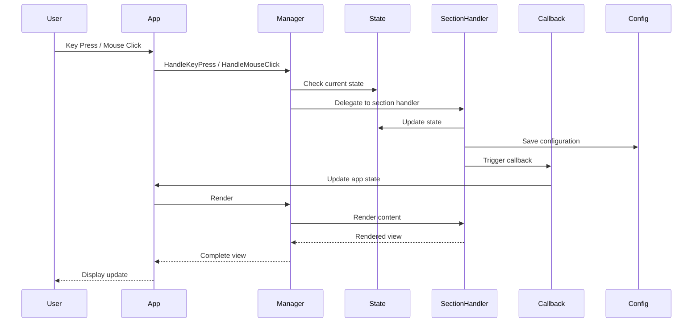

# Settings System Architecture

## Overview

The SwarmCode TUI settings system is a comprehensive configuration interface built on the Bubble Tea framework. It manages all application settings through a centralized manager with specialized handlers for each settings category.

## System Architecture

```mermaid
graph TB
    A[App] --> B[Settings Manager]
    B --> C[State Management]
    B --> D[Section Handlers]
    B --> E[Callbacks]
    
    C --> C1[types.go - State Struct]
    C --> C2[Navigation State]
    C --> C3[Form State]
    C --> C4[Modal State]
    
    D --> D1[AI Config Screens]
    D --> D2[Tools & Integrations]
    D --> D3[Appearance]
    D --> D4[Security & Auth]
    D --> D5[Performance]
    D --> D6[Advanced]
    
    D1 --> D1A[Model Settings]
    D1 --> D1B[System Prompts]
    D1 --> D1C[Agents]
    D1 --> D1D[Agent Profiles]
    D1 --> D1E[Compaction]
    
    D2 --> D2A[MCP Settings]
    D2 --> D2B[Hooks]
    D2 --> D2C[Skills]
    D2 --> D2D[Plugins]
    D2 --> D2E[Context Sources]
    
    D3 --> D3A[Display Settings]
    
    D4 --> D4A[Security]
    D4 --> D4B[Authentication]
    D4 --> D4C[Cloud]
    D4 --> D4D[Proxies]
    
    D5 --> D5A[Cache Statistics]
    D5 --> D5B[Reliability]
    
    D6 --> D6A[General]
    D6 --> D6B[Config Bundles]
    D6 --> D6C[Advanced Settings]
    
    E --> E1[onModelChange]
    E --> E2[onAuthChange]
    E --> E3[onRenderChange]
    E --> E4[onMCPChange]
    E --> E5[onProxyChange]
    E --> E6[onPromptChange]
    E --> E7[onHookChange]
    E --> E8[onAgentChange]
    E --> E9[onToolToggle]
    E --> E10[onSpinnerChange]
```



## Core Components

### 1. Manager (`manager.go`)

The central orchestrator that:
- Holds references to all settings section handlers
- Manages navigation state
- Coordinates rendering
- Dispatches callbacks to the main app

**Key responsibilities:**
- Section selection and focus management
- Sidebar rendering with grouping and search
- Content area rendering (delegates to section handlers)
- Keyboard/mouse event routing

### 2. State Management (`types.go`)

A massive centralized state struct containing:
- **Core Navigation** (46 fields)
  - `SelectedSection`, `SelectedItem`, `ScrollOffset`
  - `Focus` (Sidebar vs Content)
  - `CollapsedGroups`, `SearchQuery`
  - Exit modal state

- **Per-Screen State** (~327 fields)
  - Security: 14 fields for rules, tabs, forms
  - MCP: 25 fields for servers, tools, configuration
  - System Prompts: 10 fields for CRUD operations
  - Hooks: 26 fields for event hooks management
  - Context: 16 fields for context source config
  - Agents: 22 fields for agent creation/editing
  - Agent Profiles: 19 fields for profile management
  - Skills: 9 fields for skill browser
  - Plugins: 10 fields for plugin management

### 3. Section Handlers

Each settings category has a dedicated struct with:
- `Render(width, height int, state *State, theme Theme) string`
- `HandleKeyPress(key tea.KeyMsg, state *State) tea.Cmd`
- `HandleMouseClick(msg tea.MouseMsg) (tea.Cmd, bool)`
- Data management methods

### 4. Manager Handlers (`manager_handlers.go`)

Central event processing:
- **Keyboard input routing** - Routes key events to appropriate section
- **Mouse event handling** - Click detection and routing
- **State transitions** - Modal management, section switching
- **Global shortcuts** - Esc, Tab, Arrow keys

## Data Flow



## Navigation System

### Focus States

Two primary focus areas:
1. **Sidebar** (`FocusSidebar`) - Section selection
2. **Content** (`FocusContent`) - Section-specific interaction

**Switching:**
- `Tab` - Switch between Sidebar and Content
- `Esc` - Return to Sidebar from Content (in most screens)

### Sidebar Features

1. **Grouped Sections** - Organized into 6 groups
2. **Collapsible Groups** - Click to expand/collapse
3. **Search** - Press `/` to filter sections
4. **Visual Indicators** - Active section highlighted

### Content Area Navigation

Each section implements custom navigation:
- **List-based** - Up/Down arrow keys
- **Form-based** - Tab to move between fields
- **Modal-based** - Enter to confirm, Esc to cancel
- **Tab-based** - Left/Right to switch tabs

## Callbacks and Integration

The Manager provides 10+ callback hooks:

| Callback | Trigger | Purpose |
|----------|---------|---------|
| `onModelChange` | Model/provider changed | Reinitialize LLM client |
| `onAuthChange` | API key updated | Refresh authentication |
| `onRenderChange` | Rendering settings changed | Update display options |
| `onMCPChange` | MCP server modified | Reload MCP connections |
| `onProxyChange` | Proxy settings updated | Reconfigure API proxies |
| `onPromptChange` | System prompt activated | Apply new prompt |
| `onHookChange` | Hook enabled/disabled | Reload hook manager |
| `onAgentChange` | Agent modified | Update agent registry |
| `onToolToggle` | Tool enabled/disabled | Update tool availability |
| `onSpinnerChange` | Spinner type changed | Update UI spinner |
| `onDisplaySettingsSync` | Display settings saved | Persist to config |

## File Organization

```
settings/
├── types.go              # State struct and enums (373 lines)
├── manager.go            # Main manager (618 lines)
├── manager_handlers.go   # Event handlers (1000+ lines)
│
├── model.go              # Model & Provider settings
├── model_render.go       # Model rendering
├── model_render_forms.go # Model form rendering
├── model_update.go       # Model update logic
├── model_helpers.go      # Model utilities
│
├── system_prompt.go      # System Prompts management
├── agents.go             # Agents configuration
├── agents_render.go      # Agents rendering
├── agent_profiles.go     # Agent Profiles
├── agent_profiles_ui.go  # Profile UI
├── agent_profiles_types.go # Profile types
├── agent_config_bundle.go # Configuration bundles
├── config_bundles.go     # Bundle management
│
├── mcp.go                # MCP settings
├── mcp_render.go         # MCP rendering
├── mcp_servers.go        # MCP server management
├── tool_tester.go        # Tool testing interface
├── hooks.go              # Hooks management
├── hooks_render.go       # Hooks rendering
├── skills.go             # Skills browser
├── skills_render.go      # Skills rendering
├── plugins.go            # Plugins management
├── plugins_render.go     # Plugins rendering
├── context.go            # Context sources
├── context_render.go     # Context rendering
│
├── display.go            # Display customization
├── security.go           # Security & permissions
├── auth.go               # Authentication
├── cloud.go              # Cloud settings
├── proxies.go            # Proxy configuration
│
├── cache.go              # Cache statistics
├── reliability.go        # Reliability settings
├── compaction.go         # Compaction config
│
├── general.go            # General settings
├── advanced.go           # Advanced config
│
├── permissions_shared.go # Shared permission utilities
└── fallback_picker.go    # Fallback model picker
```

## Configuration Persistence

Settings are persisted to various configuration files:
- `~/.config/swarmcode/config.yaml` - Main configuration
- `~/.config/swarmcode/agents/*.yaml` - Agent definitions
- `~/.config/swarmcode/profiles/*.yaml` - Agent profiles
- `~/.config/swarmcode/prompts/*.yaml` - System prompts
- `~/.config/swarmcode/hooks/*.yaml` - Global hooks
- `.swarmcode/hooks/*.yaml` - Project-specific hooks
- `.swarmcode/context.yaml` - Context sources
- `.swarmcode/security.yaml` - Security rules

## Theme Integration

All rendering uses a `Theme` struct with:
- Primary, Accent, Text colors
- Background colors (BG, BGLight, BGLighter)
- Border, Success, Warning, Error colors

**Styling approach:**
- Lipgloss for all rendering
- Consistent color palette
- Focus indicators (border highlights)
- Interactive state feedback (hover, selected, active)

## Next Steps

See individual section documentation for detailed information:
- `01-ai-config/` - AI configuration screens
- `02-tools-integrations/` - Tools and integrations
- `03-appearance/` - Display settings
- `04-security-auth/` - Security and authentication
- `05-performance/` - Performance settings
- `06-advanced/` - Advanced configuration