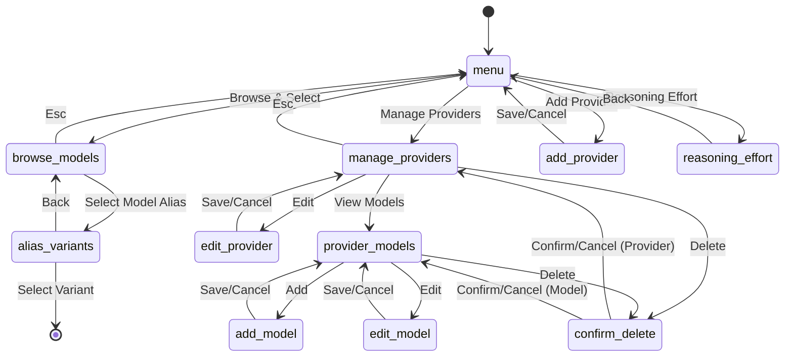
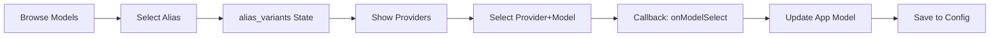
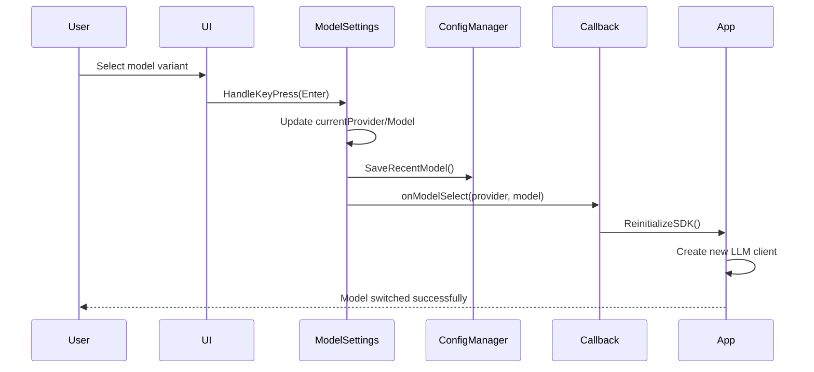

# Model & Provider Settings

**Location:** `internal/chat/settings/model.go` (2149 lines)  
**Supporting Files:** `model_render.go`, `model_render_forms.go`, `model_update.go`, `model_helpers.go`

## Purpose

The Model & Provider settings screen allows users to:
- Browse and select AI models from different providers
- Manage API providers (add, edit, remove)
- Configure model-specific settings
- Set reasoning effort for Claude models
- Favorite and track recently used models

## Screen States

The model settings has **multiple sub-screens** controlled by the `state` field:

1. **"menu"** - Main menu with 4 options
2. **"browse_models"** - Browse all models with tabs and filters
3. **"alias_variants"** - Show variants of a model alias (e.g., Claude Sonnet 4)
4. **"manage_providers"** - List all configured providers
5. **"add_provider"** - Form to add a new custom provider
6. **"edit_provider"** - Form to edit an existing provider
7. **"provider_models"** - Show models for a selected provider
8. **"models"** - Deprecated model list view
9. **"add_model"** - Form to add a custom model
10. **"edit_model"** - Form to edit a model
11. **"confirm_delete"** - Confirmation dialog for deleting models/providers

## State Flow Diagram



## Main Menu (state="menu")

### Options

| Index | Option | Description | Action |
|-------|--------|-------------|--------|
| 0 | Browse & Select Models | Choose a model family and provider | → browse_models |
| 1 | Manage Providers | View, edit, configure AI providers | → manage_providers |
| 2 | Add New Provider | Add custom OpenAI-compatible API | → add_provider |
| 3 | Reasoning Effort | Configure default reasoning effort | Show effort picker |

### Navigation
- **Up/Down** - Select menu option
- **Enter** - Activate selected option
- **Esc** - Exit settings

### Current Status Display

Shows at top:
- **Current Provider** - e.g., "anthropic"
- **Current Model** - e.g., "claude-sonnet-4-20250514"
- **Reasoning Effort** - e.g., "auto", "low", "medium", "high"

## Browse Models (state="browse_models")

### Features

1. **Tabbed Filtering**
   - Fast/Cheap
   - Long Context (128K+)
   - Coding
   - Vision
   - All

2. **Search** - Press `/` to search models

3. **Favorite Models** - Star icon for favorited models

4. **Recent Models** - Clock icon for recently used

5. **Grouped by Model Alias** - Models are grouped (e.g., "Claude Sonnet 4", "GPT-4")

### UI Layout

```
┌─────────────────────────────────────────────────┐
│ Browse Models                                    │
│ [Fast/Cheap] [Long Context] [Coding] [Vision] [All] │
├─────────────────────────────────────────────────┤
│ Search: /                                        │
├─────────────────────────────────────────────────┤
│ ★ Claude Sonnet 4  (4 providers)               │
│   GPT-4 Turbo      (2 providers)               │
│   Gemini 2.0 Flash (1 provider)                │
│ ⏱ DeepSeek V3      (1 provider)                │
└─────────────────────────────────────────────────┘
```

### Navigation
- **Tab/Shift+Tab** - Cycle through filter tabs
- **Up/Down** - Navigate model aliases
- **Enter** - Show variants for selected alias
- **/** - Activate search
- **f** - Toggle favorite on selected model
- **Esc** - Return to menu

### Data Flow



## Alias Variants (state="alias_variants")

Shows all provider/model combinations for a selected model alias.

### Example: "Claude Sonnet 4"

```
┌─────────────────────────────────────────────────┐
│ Claude Sonnet 4 - Select Provider               │
├─────────────────────────────────────────────────┤
│ ▶ anthropic / claude-sonnet-4-20250514         │
│   openrouter / anthropic/claude-sonnet-4       │
│   aws / bedrock/anthropic.claude-sonnet-4-v1   │
│   vertex-ai / claude-sonnet-4@20250514         │
└─────────────────────────────────────────────────┘
```

### Navigation
- **Up/Down** - Select provider variant
- **Enter** - Activate selected model
- **Esc** - Return to browse_models

### What Happens on Selection

1. **Update internal state** - `currentProvider`, `currentModel`
2. **Call callback** - `onModelSelect(provider, model)`
3. **Save to config** - Add to recent models
4. **Reload app** - Trigger model change in main app
5. **Return to menu** - Exit settings

## Manage Providers (state="manage_providers")

Lists all configured AI providers.

### Provider Display

Each provider shows:
- **Icon** - Color-coded badge
- **Name** - e.g., "OpenAI", "Anthropic", "OpenRouter"
- **Type** - "Built-in" vs "Custom"
- **Auth** - OAuth or API Key
- **Status** - Authenticated, Not authenticated
- **Model Count** - Number of models available

### Actions

| Key | Action | Effect |
|-----|--------|--------|
| Enter | Edit provider | → edit_provider state |
| m | View models | → provider_models state |
| d | Delete provider | → confirm_delete dialog |
| r | Refresh (OpenRouter only) | Fetch latest models |

### OpenRouter Special Feature

When OpenRouter is selected:
- **r key** - Refreshes model list from OpenRouter API
- Shows status message with count

## Add Provider Form (state="add_provider")

Multi-field form to add a custom provider.

### Form Fields

| Index | Field | Type | Description |
|-------|-------|------|-------------|
| 0 | Provider Type | Dropdown | OpenAI, Anthropic, Gemini, Cerebras, Custom |
| 1 | Display Name | Text | User-friendly name |
| 2 | API Endpoint | Text | Base URL for API |
| 3 | Auth Type | Dropdown | oauth or api_key |
| 4 | API Key | Password | API key (if auth_type=api_key) |
| 5 | Color | Color Picker | Badge color |
| 6 | Save | Button | Validate and save |

### Form Validation

- **Display Name** - Required, must be unique
- **API Endpoint** - Required, must be valid URL
- **API Key** - Required if auth_type=api_key

### Navigation
- **Tab** - Move to next field
- **Shift+Tab** - Move to previous field
- **Enter** - Edit current field or activate button
- **Esc** - Cancel and return to menu

### Auto-fill Feature

When Provider Type is selected, it auto-fills the API Endpoint:
- OpenAI → `https://api.openai.com/v1`
- Anthropic → `https://api.anthropic.com/v1`
- Gemini → `https://cloudcode-pa.googleapis.com`
- Cerebras → `https://api.cerebras.ai/v1`
- Custom → (blank)

## Edit Provider Form (state="edit_provider")

Same as Add Provider form, but:
- Pre-filled with existing values
- **Built-in providers** - Limited editing (can't change type or endpoint)
- **Custom providers** - Full editing

### Built-in Provider Restrictions

Built-in providers (OpenAI, Anthropic, etc.) only allow editing:
- Display Name
- API Key
- Color

## Provider Models (state="provider_models")

Shows all models for a selected provider.

### Display

```
┌─────────────────────────────────────────────────┐
│ OpenAI Models                                    │
├─────────────────────────────────────────────────┤
│ ▶ gpt-4-turbo                                   │
│   gpt-4                                         │
│   gpt-3.5-turbo                                 │
│   gpt-4o                                        │
├─────────────────────────────────────────────────┤
│ [Add Model]                                     │
└─────────────────────────────────────────────────┘
```

### Actions

| Key | Action | Effect |
|-----|--------|--------|
| Enter | Edit model | → edit_model state |
| a | Add model | → add_model state |
| d | Delete model | → confirm_delete dialog |
| Esc | Back | → manage_providers |

## Add/Edit Model Form (state="add_model"/"edit_model")

Configure model-specific settings.

### Form Fields

| Index | Field | Type | Description |
|-------|-------|------|-------------|
| 0 | Model ID | Text | API identifier (e.g., "gpt-4-turbo") |
| 1 | Display Name | Text | User-friendly name |
| 2 | Context Window | Text | Max tokens (e.g., "128000") |
| 3 | Thinking Enabled | Toggle | Enable thinking mode |
| 4 | Thinking Budget | Number | Max thinking tokens (if enabled) |
| 5 | Thinking Effort | Dropdown | low/medium/high (if enabled) |
| 6 | Save | Button | Validate and save |

### Navigation
- **Tab/Shift+Tab** - Move between fields
- **Enter** - Edit field or save
- **Esc** - Cancel

## Reasoning Effort Picker

Inline picker for Claude's reasoning effort setting.

### Options

| Value | Description | Use Case |
|-------|-------------|----------|
| auto | Let Claude decide | General use |
| low | Faster responses | Simple questions |
| medium | Balanced | Standard coding |
| high | Deep reasoning | Complex problems |

### Navigation
- **Up/Down** - Select effort level
- **Enter** - Apply and save
- **Esc** - Cancel

### Effect

1. Updates `reasoningEffort` field
2. Saves to config via `configManager.UpdateConfig()`
3. Calls `onReasoningEffortChange(effort)` callback
4. Returns to menu

## State Management

### Core State Fields

```go
type ModelSettings struct {
    currentProvider   string               // Active provider
    currentModel      string               // Active model
    providers         []commands.Provider  // All providers
    state             string               // Current sub-screen
    selectedProvider  int                  // Selected index in lists
    selectedModel     int                  // Selected model index
    selectedAlias     int                  // Selected alias index
    selectedVariant   int                  // Selected variant index
    selectedMenuItem  int                  // Menu selection
    scrollOffset      int                  // Scroll position
    aliasEntries      []commands.ModelAliasEntry  // Grouped models
    favoriteModels    []commands.ModelRef  // User favorites
    recentModels      []commands.ModelRef  // Recently used
    reasoningEffort   string               // Claude reasoning setting
    
    // Search & Filter
    searchQuery       string
    searchActive      bool
    tabIndex          int                  // Filter tab
    filterProvider    string
    filterContext     int                  // Context size filter
    filterTags        map[ModelTag]bool    // Tag filters
    collapsedGroups   map[string]bool      // Collapsed model groups
    
    // Form State (Add/Edit Provider)
    formField        int
    formProviderType string
    formAuthType     string
    formDisplayName  string
    formAPIEndpoint  string
    formAPIKey       string
    formColorIndex   int
    formEditing      bool
    formCursorPos    int
    
    // Model Form State
    modelFormField          int
    modelFormID             string
    modelFormDisplayName    string
    modelFormContext        string
    modelFormThinkingEnabled bool
    modelFormThinkingBudget int
    modelFormThinkingEffort string
    editingModelIndex       int
    
    // Confirmation Dialog
    confirmDeleteType    string  // "model" or "provider"
    confirmDeleteIndex   int
    confirmSelected      int     // 0=No, 1=Yes
    confirmPreviousState string
}
```

## Callbacks

### onModelSelect(provider, model string)

**Triggered when:** User selects a model variant

**Effect:**
1. Update app's current model
2. Reinitialize SDK with new model
3. Clear conversation history (optional)
4. Save to config file

### onReasoningEffortChange(effort string)

**Triggered when:** Reasoning effort is changed

**Effect:**
1. Update SDK reasoning effort setting
2. Save to config file
3. Apply to future requests

## Configuration Persistence

### Saved to `~/.config/swarmcode/config.yaml`

```yaml
model:
  provider: anthropic
  model: claude-sonnet-4-20250514
  reasoning_effort: auto

providers:
  - name: openai
    display_name: OpenAI
    endpoint: https://api.openai.com/v1
    auth_type: api_key
    api_key: sk-...
    color: "#00FFFF"
    models:
      - id: gpt-4-turbo
        display_name: GPT-4 Turbo
        context: 128000

favorite_models:
  - provider: anthropic
    model: claude-sonnet-4-20250514
  - provider: openai
    model: gpt-4-turbo

recent_models:
  - provider: anthropic
    model: claude-sonnet-4-20250514
    timestamp: 2026-02-16T10:30:00Z
```

## Data Flow



## Special Features

### 1. OpenRouter Integration

- **Auto-refresh** - Press `r` to fetch latest models
- **Model discovery** - Automatically adds new OpenRouter models
- **Rate limiting** - Respects API rate limits

### 2. Model Aliasing

Models are grouped by alias (e.g., "Claude Sonnet 4") across providers:
- `anthropic/claude-sonnet-4-20250514`
- `openrouter/anthropic/claude-sonnet-4`
- `aws/bedrock/anthropic.claude-sonnet-4-v1`

### 3. Context Window Filtering

Long Context tab filters models with ≥128K context window.

### 4. Tag-based Filtering

Models can have tags:
- `TagFast` - Optimized for speed
- `TagCoding` - Enhanced for code
- `TagVision` - Image understanding
- `TagLongContext` - Large context windows

## Error Handling

### Common Errors

1. **Invalid API Key** - Shows error in provider list
2. **Network Error** - Retry with exponential backoff
3. **Provider Not Found** - Fallback to default provider
4. **Model Not Available** - Show warning, keep current model

### Validation

- API endpoints must be valid URLs
- Model IDs must be unique within a provider
- Display names must not be empty
- Context window must be a positive integer

## Keyboard Shortcuts Summary

| Key | Context | Action |
|-----|---------|--------|
| Up/Down | All | Navigate lists/menus |
| Enter | All | Activate/Edit item |
| Esc | All | Go back/Cancel |
| Tab | Forms | Next field |
| Shift+Tab | Forms | Previous field |
| / | Browse | Search models |
| f | Browse | Toggle favorite |
| r | Manage Providers (OpenRouter) | Refresh models |
| m | Manage Providers | View provider models |
| d | Lists | Delete item |
| a | Provider Models | Add model |

## Visual Indicators

- **★** - Favorite model
- **⏱** - Recently used model
- **▶** - Selected/Active item
- **[OAuth]** - OAuth authentication
- **[API Key]** - API key authentication
- **Color Badges** - Provider identification