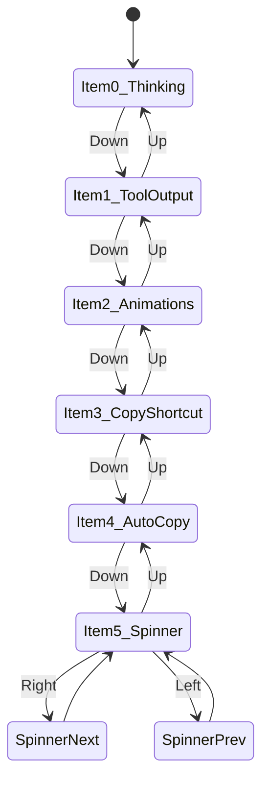
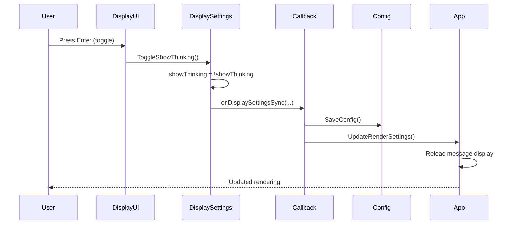

# Display Settings

**Location:** `internal/chat/settings/display.go` (520 lines)  
**Purpose:** Customize UI rendering, animations, and interaction behavior

## Overview

The Display settings screen provides toggles and pickers for customizing how the TUI renders and behaves. This is a simple, single-screen settings panel with no sub-states.

## Settings Available

### 1. Show Thinking Blocks

**Type:** Toggle  
**Default:** `false`  
**Field:** `showThinking`

**Purpose:** Display AI reasoning process in responses

**Effect:**
- When enabled: Shows `<thinking>` blocks in Claude's extended thinking responses
- When disabled: Hides thinking blocks, only shows final response

**Visual Example:**
```
[Enabled]
<thinking>
Let me analyze the requirements...
- Need to check file permissions
- Consider edge cases
</thinking>

Here's the solution...

[Disabled]
Here's the solution...
```

### 2. Show Full Tool Output

**Type:** Toggle  
**Default:** `false`  
**Field:** `showFullToolOutput`

**Purpose:** Show complete tool execution results

**Effect:**
- When enabled: Shows all output from tool calls
- When disabled: Truncates long tool outputs

**Use case:** Debugging tool interactions, seeing full bash output

### 3. Rich Animations

**Type:** Toggle  
**Default:** `true`  
**Field:** `richAnimations`

**Purpose:** Enable animated UI flourishes

**Effect:**
- When enabled: Smooth transitions, spinner animations, color gradients
- When disabled: Static rendering, better terminal compatibility

**Performance impact:** Minimal, but can disable for SSH/slow terminals

### 4. Copy Selection Shortcut

**Type:** Toggle  
**Default:** `false`  
**Field:** `copySelectionShortcut`

**Purpose:** Enable copy selection with Ctrl+Shift+C

**Effect:**
- When enabled: Ctrl+Shift+C copies selected text to clipboard
- When disabled: Standard terminal copy behavior

**Platform support:** Works on Linux, macOS with proper terminal support

### 5. Auto-copy Selection on Mouse

**Type:** Toggle  
**Default:** `false`  
**Field:** `autoCopySelectionOnMouse`

**Purpose:** Automatically copy text when selected with mouse

**Effect:**
- When enabled: Text is copied to clipboard on mouse release
- When disabled: Must use Ctrl+Shift+C or terminal shortcut

**Note:** Requires mouse support in terminal

### 6. Spinner Type

**Type:** Dropdown/Picker  
**Default:** `"Braille"`  
**Field:** `spinnerType`

**Purpose:** Choose loading spinner animation style

**Available Options:**

| Type | Description | Visual Example |
|------|-------------|----------------|
| Matrix | Cyberpunk random characters | `⚡ ◆ ╋ ╬ ⚡` |
| Braille | Classic minimalist dots | `⠋ ⠙ ⠹ ⠸ ⠼` |
| Blocks | Building blocks loading | `▁ ▂ ▃ ▄ ▅ ▆ ▇ █` |
| Wave | Smooth wave pattern | `~ ≈ ∿ ⁓ ∼` |
| Pulse | Pulsing circles with glow | `○ ◉ ● ◉ ○` |
| Bounce | Bouncing ball between walls | `⎢●   ⎟` `⎢  ● ⎟` |
| Aurora | Northern lights color shimmer | `✨ 🌟 ✨ 💫` |
| DNA Helix | Double helix strand | `🧬 ⚛️ 🧬 ⚛️` |

**Effect:** Changes the visual style shown during AI thinking/processing

## Screen Layout

```
┌──────────────────────────────────────────────────────┐
│              Display Settings                        │
│    Customize what you see in the interface          │
├──────────────────────────────────────────────────────┤
│                                                      │
│ ▶ Show Thinking Blocks                  [OFF]       │
│   Display AI reasoning process in responses         │
│                                                      │
│   Show Full Tool Output                 [OFF]       │
│   Show complete tool execution results              │
│                                                      │
│   Rich Animations                       [ON]        │
│   Enable animated UI flourishes                     │
│                                                      │
│   Copy Selection Shortcut               [OFF]       │
│   Enable copy selection with Ctrl+Shift+C           │
│                                                      │
│   Auto-copy Selection                   [OFF]       │
│   Copy selection on mouse release                   │
│                                                      │
│ ▶ Spinner Type                                      │
│                                                      │
│   < Braille >                                       │
│   Classic minimalist braille dots spinner           │
│                                                      │
│   [Preview: ⠋⠙⠹⠸⠼⠴⠦⠧⠇⠏ ]                         │
│                                                      │
└──────────────────────────────────────────────────────┘
Hints: ↑/↓ Navigate | Enter Toggle | ←/→ Change Spinner | Esc Exit
```

## Navigation

### Keyboard Shortcuts

| Key | Action | Context |
|-----|--------|---------|
| Up/Down | Navigate items | All |
| Enter | Toggle selected setting | Toggles (items 0-4) |
| Left/Right | Change spinner type | Spinner picker (item 5) |
| Space | Toggle setting | Toggles |
| Esc | Exit settings | All |
| Tab | Switch to sidebar | All |

### Navigation Flow



## State Management

### State Structure

Display settings uses the shared `State` struct but only requires:
- `SelectedItem` - Currently selected setting (0-5)
- `Focus` - Whether focused on content or sidebar

**No dedicated sub-state** - Simple list navigation

### Internal Fields

```go
type DisplaySettings struct {
    showThinking             bool
    showFullToolOutput       bool
    richAnimations           bool
    copySelectionShortcut    bool
    autoCopySelectionOnMouse bool
    spinnerType              string // "Matrix", "Braille", etc.
}
```

## Interaction Details

### Toggle Settings (Items 0-4)

**On Enter/Space:**
1. Toggle boolean value
2. Trigger callback: `onDisplaySettingsSync()`
3. Update display immediately
4. Save to config file

**Visual feedback:**
- Selected item: `▶` indicator and highlighted
- Toggle state: `[ON]` or `[OFF]` badge
- Color coding: ON = green, OFF = dim

### Spinner Picker (Item 5)

**On Left Arrow:**
1. Call `PrevSpinnerType()`
2. Cycle to previous spinner in list
3. Trigger callback: `onSpinnerChange(spinnerType)`
4. Update preview animation
5. Save to config

**On Right Arrow:**
1. Call `NextSpinnerType()`
2. Cycle to next spinner in list
3. Trigger callback
4. Update preview
5. Save to config

**Preview Animation:**
- Shows live animated preview of selected spinner
- Uses shared `animationFrame` clock from app
- Loops continuously

## Data Flow



## Callbacks

### onDisplaySettingsSync

**Signature:**
```go
func(showThinking, showFullToolOutput, richAnimations, 
     copySelectionShortcut, autoCopySelectionOnMouse bool) tea.Cmd
```

**Triggered when:** Any toggle is changed

**Effect:**
1. Save all display settings to config
2. Update app rendering state
3. Refresh message display if needed

### onSpinnerChange

**Signature:**
```go
func(spinnerType string) tea.Cmd
```

**Triggered when:** Spinner type is changed

**Effect:**
1. Update app spinner component
2. Save to config
3. Apply to all active spinners

### onRenderChange

**Signature:**
```go
func() tea.Cmd
```

**Triggered when:** Any render-affecting setting changes

**Effect:**
1. Full re-render of UI
2. Apply new animation settings
3. Update all visual components

## Configuration Persistence

### Saved to `~/.config/swarmcode/config.yaml`

```yaml
display:
  show_thinking: false
  show_full_tool_output: false
  rich_animations: true
  copy_selection_shortcut: false
  auto_copy_selection_on_mouse: false
  spinner_type: "Braille"
```

### Default Values

```yaml
display:
  show_thinking: false           # Hide thinking by default
  show_full_tool_output: false   # Truncate tool output
  rich_animations: true           # Enable animations
  copy_selection_shortcut: false  # Terminal default copy
  auto_copy_selection_on_mouse: false  # Manual copy
  spinner_type: "Braille"        # Best terminal compatibility
```

## Spinner Implementation

### Spinner Types and Rendering

Each spinner type is implemented in the app's spinner component:

**Matrix:**
```go
frames := []string{"⚡", "◆", "╋", "╬", "⚡"}
// Random character cycling effect
```

**Braille:**
```go
frames := []string{"⠋", "⠙", "⠹", "⠸", "⠼", "⠴", "⠦", "⠧", "⠇", "⠏"}
// Classic spinner dots
```

**Blocks:**
```go
frames := []string{"▁", "▂", "▃", "▄", "▅", "▆", "▇", "█", "▇", "▆", "▅", "▄", "▃", "▂"}
// Building up and down
```

**Live Preview:**
- Rendered in the settings screen
- Updates at 10 FPS (animationFrame % 10)
- Shows actual spinner in action

## Use Cases

### 1. Debugging AI Reasoning

**Enable:**
- Show Thinking Blocks
- Show Full Tool Output

**Purpose:** See full AI decision-making process

### 2. Performance Optimization

**Disable:**
- Rich Animations

**Purpose:** Better performance on slow terminals/SSH

### 3. Power User Workflow

**Enable:**
- Copy Selection Shortcut
- Auto-copy Selection on Mouse

**Purpose:** Quick text copying without terminal shortcuts

### 4. Clean Presentation

**Disable:**
- Show Thinking Blocks
- Show Full Tool Output

**Purpose:** Cleaner output for demos/screenshots

## Visual Design

### Color Scheme

- **Selected item:** Primary color (cyan/blue)
- **ON state:** Success green
- **OFF state:** Dim gray
- **Descriptions:** Muted text
- **Spinner preview:** Animated with theme colors

### Layout Spacing

- **Padding:** 2 spaces left/right
- **Item spacing:** 1 blank line between items
- **Section spacing:** 2 blank lines for spinner section
- **Preview box:** Bordered box with padding

## Error Handling

### Invalid Spinner Type

If config contains invalid spinner type:
1. Fall back to "Braille" (default)
2. Log warning
3. Save corrected value

### Config Save Failure

If saving fails:
1. Show error message in UI
2. Keep setting in memory
3. Retry on next change

## Integration with App

### Message Rendering

Display settings affect how messages are rendered:

**Show Thinking:**
```go
if displaySettings.GetShowThinking() {
    renderThinkingBlock(block)
}
```

**Show Full Tool Output:**
```go
maxLines := 10
if displaySettings.GetShowFullToolOutput() {
    maxLines = -1  // unlimited
}
```

### Spinner Integration

```go
spinner := NewSpinner(displaySettings.GetSpinnerType())
spinner.Start()
```

### Animation Control

```go
if displaySettings.GetRichAnimations() {
    transitionDuration = 300ms
    enableGradients = true
} else {
    transitionDuration = 0ms
    enableGradients = false
}
```

## Accessibility

### Terminal Compatibility

- **Braille spinner** - Works in all terminals
- **Matrix/Aurora** - Requires Unicode support
- **Animations** - Can be disabled for screen readers

### Keyboard-only Navigation

All settings fully accessible via keyboard:
- No mouse required
- Clear visual focus indicators
- Simple key combinations

### Screen Reader Support

- Descriptive labels for all settings
- Toggle state announced (ON/OFF)
- Spinner type name announced

## Performance Considerations

### Animation Frame Rate

- **Rich Animations ON:** 60 FPS
- **Rich Animations OFF:** 10 FPS (text-only updates)

### Memory Usage

- Minimal: ~1KB for settings state
- No caching needed
- Immediate persistence

## Future Enhancements

Potential additions (not yet implemented):
- Custom spinner designs
- Theme selection
- Font size controls
- Layout density options
- Color customization
- Syntax highlighting themes