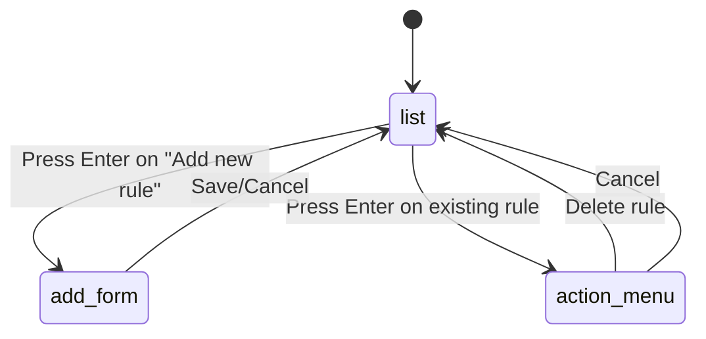
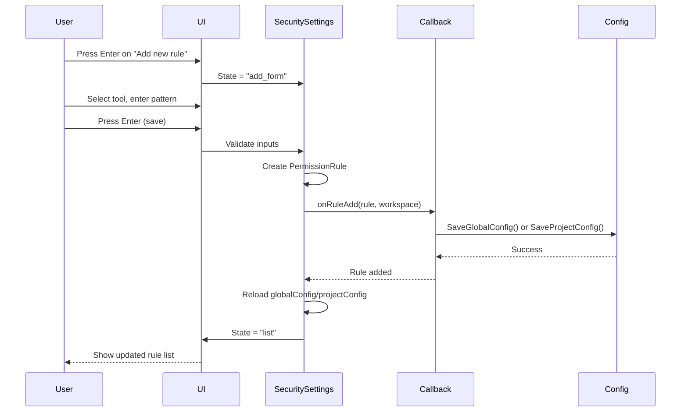
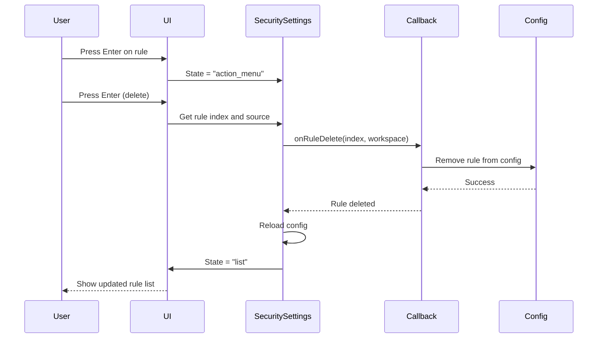
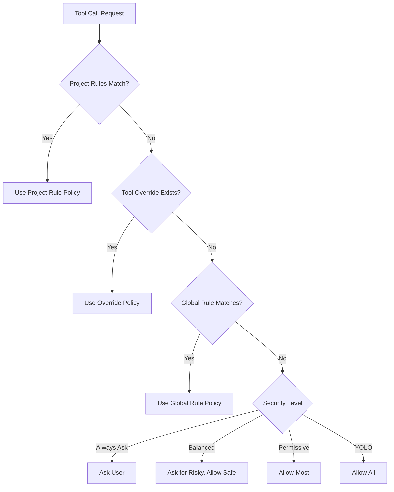

# Security & Permissions Settings

**Location:** `internal/chat/settings/security.go` (1039 lines)  
**Purpose:** Configure tool permissions, security levels, and access control rules

## Overview

The Security settings screen manages which tools the AI can use and under what conditions. It provides fine-grained control over:
- Tool execution permissions
- Command pattern matching
- File path restrictions
- URL access controls
- Global vs workspace-specific rules

## Permission Levels

### 4 Security Levels

| Level | Description | Use Case |
|-------|-------------|----------|
| **Always Ask** | Prompt for every tool use | Maximum security, manual control |
| **Balanced** | Ask for risky tools only | Recommended default |
| **Permissive** | Allow most tools automatically | Trusted environments |
| **YOLO** | Allow everything without asking | Development/testing only |

### Level Selection

Displayed at top of screen:
```
Level: [ Always Ask ]  Balanced  Permissive  YOLO
```

- **Navigation:** Not directly selectable in current UI
- **Change:** Through config file or API
- **Visual:** Active level highlighted in primary color
- **YOLO Warning:** Red color to indicate danger

## Tab System

### 4 Permission Tabs

| Tab | Index | Policy | Description |
|-----|-------|--------|-------------|
| Allow | 0 | PolicyAllow | Tools/commands always allowed |
| Ask | 1 | PolicyAsk | Require approval before use |
| Deny | 2 | PolicyDeny | Blocked from use |
| Workspace | 3 | (project) | Project-specific rules |

### Tab Navigation

- **Tab key** - Cycle through tabs
- **Visual** - Active tab highlighted
- **Description** - Each tab shows explanatory text

### Tab-specific Content

Each tab shows:
- Rules matching that tab's policy
- Tool overrides for that policy
- "Add a new rule..." option
- Search filtering

## Screen States

### State Machine



### 1. List View (state="list")

Default view showing:
- Permission level indicator
- Tab selector
- Search box
- List of rules
- "Add a new rule..." option

### 2. Add Form (state="add_form")

Inline form for creating new rules:
- Tool selector
- Pattern input
- Policy (determined by active tab)

### 3. Action Menu (state="action_menu")

Overlay menu for existing rules:
- Delete option
- Cancel option

## UI Layout

```
┌──────────────────────────────────────────────────────────┐
│  Security & Permissions                                  │
│                                                          │
│  Level: [ Balanced ]  Permissive  YOLO                  │
│                                                          │
│  ────────────────────────────────────────────────────   │
│                                                          │
│  Permissions:  Allow   Ask   Deny   Workspace  (Tab ▸)  │
│                                                          │
│  Tools and commands that require approval before use.   │
│                                                          │
│  ┌─────────────────────────────────────────────────┐   │
│  │  ⌘ Search...                                    │   │
│  └─────────────────────────────────────────────────┘   │
│                                                          │
│   1. Add a new rule…                                    │
│   2. Bash(curl:*)                                       │
│  ❯3. Bash(rm:*)                                         │
│   4. Bash(npm install:*)                                │
│   5. Write(/etc/*)                                      │
│                                                          │
└──────────────────────────────────────────────────────────┘
Hints: ↑/↓ Navigate | Enter Select/Edit | Tab Cycle Tabs | / Search | Esc Exit
```

## Rule Structure

### Display Format

Rules displayed as: `Tool(pattern)`

Examples:
- `Bash(curl:*)` - All curl commands
- `Bash(npm install:*)` - npm install commands
- `Write(/etc/*)` - Writing to /etc directory
- `Read(*.env)` - Reading .env files
- `WebFetch(*)` - All web fetch calls

### Pattern Types

| Type | Field | Example | Description |
|------|-------|---------|-------------|
| Command | Commands.Glob | `curl:*` | Shell command patterns |
| Path | Paths.Glob | `/etc/*` | File path patterns |
| URL | URLs.Glob | `https://*.com` | URL patterns |

### Tool Overrides

Tool-wide overrides displayed as: `Tool(*)`

Example: `Bash(*)` - All Bash commands

## Add Rule Form

### Form Fields

| Index | Field | Type | Description |
|-------|-------|------|-------------|
| 0 | Tool | Dropdown | Tool name (Bash, Read, Write, etc.) |
| 1 | Pattern | Text Input | Glob pattern for matching |

### Tool Selection

**Navigation:**
- **Left/Right arrows** - Cycle through available tools
- **Display:** `[ Bash ]` with bracket indicators

**Available Tools:**
- Dynamic list from `availableTools` field
- Includes builtin + MCP tools
- Default: Bash, Read, Write, Edit, Glob, Grep, WebFetch, WebSearch, Task, NotebookEdit

### Pattern Input

**Format:** Glob pattern with special syntax

**Command Patterns:**
```
npm install *      → Matches any npm install command
curl:*             → Matches any curl command
git push:*         → Matches any git push command
```

**Path Patterns:**
```
/etc/*             → Matches any file in /etc
*.env              → Matches any .env file
~/.ssh/*           → Matches files in .ssh directory
```

**URL Patterns:**
```
https://*.com      → Matches any .com URL
https://api.*      → Matches any API subdomain
```

**Navigation:**
- **Type** - Input pattern text
- **Left/Right** - Move cursor
- **Backspace** - Delete character
- **Cursor:** Block character `█` shows position

### Policy Assignment

Policy is **automatically determined** by active tab:
- Allow tab → PolicyAllow
- Ask tab → PolicyAsk
- Deny tab → PolicyDeny
- Workspace tab → PolicyAllow (workspace-scoped)

Display shows: `Policy: Ask (based on current tab)`

### Validation

- **Tool** - Must be from available tools list
- **Pattern** - Must not be empty
- **Scope** - Workspace tab creates project-specific rule

### Saving

**On Enter (when on Save field):**
1. Validate inputs
2. Create PermissionRule struct
3. Call `onRuleAdd(rule, workspace)` callback
4. Save to config file
5. Return to list view
6. Refresh rule list

**On Esc:**
- Cancel without saving
- Return to list view

## Navigation

### List View

| Key | Action | Effect |
|-----|--------|--------|
| Up/Down | Navigate rules | Move selection |
| Enter | Select rule | Add new or show action menu |
| Tab | Cycle tabs | Switch between Allow/Ask/Deny/Workspace |
| / | Search | Filter rules (not implemented) |
| Esc | Exit | Return to settings menu |
| PgUp/PgDn | Scroll | Fast navigation |

### Add Form

| Key | Action | Effect |
|-----|--------|--------|
| Tab/Down | Next field | Move to pattern |
| Shift+Tab/Up | Previous field | Move to tool |
| Left/Right | Change tool | Cycle through tools (field 0) |
| Type | Input pattern | Add characters (field 1) |
| Backspace | Delete | Remove character |
| Enter | Save | Create rule |
| Esc | Cancel | Return to list |

### Action Menu

| Key | Action | Effect |
|-----|--------|--------|
| Enter | Delete | Remove rule (shows confirmation) |
| Esc | Cancel | Close menu |

## Rule Display Items

### RuleDisplayItem Structure

```go
type RuleDisplayItem struct {
    Label     string                 // "Bash(curl:*)"
    Policy    tools.PermissionPolicy // allow/ask/deny
    Source    string                 // "rule", "override", "project"
    RuleIndex int                    // Index in rules array (-1 for overrides)
    ToolName  string                 // Tool name (for overrides)
}
```

### Source Types

1. **"rule"** - Regular permission rule
   - Has pattern matching
   - Index points to globalConfig.Rules
   - Can be deleted

2. **"override"** - Tool-wide override
   - Matches all patterns for tool
   - Stored in globalConfig.Overrides.Tools
   - RuleIndex = -1

3. **"project"** - Workspace-specific rule
   - Stored in project config
   - Index points to projectConfig.Rules
   - Only in Workspace tab

## Search Functionality

### Search Box

Displayed at top of rule list:
```
┌─────────────────────────────────────────┐
│  ⌘ Search...                            │
└─────────────────────────────────────────┘
```

### Search Query

- **Field:** `state.SecuritySearchQuery`
- **Placeholder:** "Search..." (dimmed when empty)
- **Active:** Shows query text
- **Case-insensitive matching** on rule labels

### Filtering Logic

```go
func buildDisplayItems(tab int, search string) []RuleDisplayItem {
    searchLower := strings.ToLower(strings.TrimSpace(search))
    
    for each rule:
        label := ruleDisplayLabel(rule)
        if searchLower != "" && !strings.Contains(strings.ToLower(label), searchLower):
            continue  // Skip non-matching rules
        
        items.append(rule)
}
```

## State Management

### Security State Fields (in main State struct)

```go
// Security settings state
SecuritySelected      int      // Selected rule index (-1 = Add new)
SecurityScrollOffset  int      // Scroll position in list
SecurityLevelSelected int      // Permission level (0-3)

// Security rules management
SecurityTab              int    // 0=Allow, 1=Ask, 2=Deny, 3=Workspace
SecuritySearchQuery      string // Search filter text
SecurityRulesState       string // "list", "action_menu", "add_form"
SecurityRuleActionChoice int    // 0=Delete
SecurityAddFormField     int    // 0=tool, 1=pattern
SecurityAddFormTool      string // Tool name for new rule
SecurityAddFormPattern   string // Glob pattern for new rule
SecurityAddCursorPos     int    // Cursor position in pattern input
```

### Internal Fields

```go
type SecuritySettings struct {
    level          tools.PermissionLevel           // Current security level
    permissions    []PermissionInfo                // Legacy permission list
    globalConfig   tools.PermissionConfig          // Global rules and overrides
    projectConfig  tools.PermissionConfig          // Project-specific rules
    availableTools []string                        // All tool names (builtin + MCP)
    
    // Callbacks
    onPermissionChange func(permission, policy)
    onLevelChange      func(level)
    onRuleAdd          func(rule, workspace)
    onRuleDelete       func(ruleIndex, workspace)
    onOverrideDelete   func(tool)
}
```

## Data Flow

### Adding a Rule



### Deleting a Rule



## Callbacks

### onPermissionChange

**Signature:**
```go
func(permission tools.Permission, policy tools.PermissionPolicy) error
```

**Triggered:** When permission for a specific capability changes

**Effect:**
1. Update global permission config
2. Save to config file
3. Apply to future tool calls

**Legacy:** Kept for backward compatibility, prefer rules

### onLevelChange

**Signature:**
```go
func(level tools.PermissionLevel) error
```

**Triggered:** When security level changes

**Effect:**
1. Update global security level
2. Recalculate default policies
3. Save to config file

### onRuleAdd

**Signature:**
```go
func(rule tools.PermissionRule, workspace bool) error
```

**Parameters:**
- `rule` - Complete permission rule with When/Then conditions
- `workspace` - true for project-specific, false for global

**Triggered:** When user saves new rule from add form

**Effect:**
1. Append rule to appropriate config (global or project)
2. Save config file to disk
3. Reload permission engine
4. Apply to future tool calls

### onRuleDelete

**Signature:**
```go
func(ruleIndex int, workspace bool) error
```

**Parameters:**
- `ruleIndex` - Index in rules array
- `workspace` - true for project rules, false for global

**Triggered:** When user confirms deletion from action menu

**Effect:**
1. Remove rule from config
2. Save config file
3. Reload permission engine

### onOverrideDelete

**Signature:**
```go
func(tool string) error
```

**Parameters:**
- `tool` - Tool name (e.g., "Bash")

**Triggered:** When user deletes a tool override (e.g., "Bash(*)")

**Effect:**
1. Remove tool from global config overrides
2. Save config file
3. Fall back to rule-based or level-based policy

## Configuration Persistence

### Global Config (`~/.config/swarmcode/security.yaml`)

```yaml
level: balanced

rules:
  - when:
      tools: [Bash]
      commands:
        glob: ["curl:*"]
    then:
      policy: ask
  
  - when:
      tools: [Write]
      paths:
        glob: ["/etc/*"]
    then:
      policy: deny
  
  - when:
      tools: [WebFetch]
      urls:
        glob: ["https://*.com"]
    then:
      policy: allow

overrides:
  tools:
    Bash: always_ask      # Bash(*) - all bash commands
    WebFetch: always_allow # WebFetch(*) - all web fetches
```

### Project Config (`.swarmcode/security.yaml`)

```yaml
rules:
  - when:
      tools: [Bash]
      commands:
        glob: ["npm install:*"]
    then:
      policy: allow
  
  - when:
      tools: [Read]
      paths:
        glob: ["*.env"]
    then:
      policy: deny
```

## Rule Precedence

Rules are evaluated in order:

1. **Project-specific rules** (highest priority)
2. **Tool overrides** (e.g., "Bash(*)")
3. **Global rules** (pattern-matched)
4. **Level-based defaults** (fallback)

### Evaluation Flow



## Special Features

### Empty State

When no rules exist for a tab:
```
  No rules configured for this category.
```

### Scrolling

- Auto-scroll to keep selection visible
- PgUp/PgDn for fast navigation
- Maintains position when switching tabs

### Workspace Tab

- Only shows project-specific rules
- Rules saved to `.swarmcode/security.yaml`
- Separate from global configuration
- Ideal for project-specific restrictions

## Error Handling

### Validation Errors

- Empty pattern → Show error, stay in form
- Invalid tool → Reset to default (Bash)
- Invalid config file → Use defaults, log warning

### Config Save Failures

- Show error message
- Keep rule in memory
- Retry on next change

## Visual Indicators

- **❯** - Selected item
- **⌘** - Search icon
- **[...]** - Active/selected state
- **█** - Text cursor
- **Red** - YOLO level warning
- **Italics** - Empty state, hints
- **Bold** - Selected, active elements

## Future Enhancements

Potential additions:
- Regex pattern support
- Import/export rules
- Rule templates
- Test rule matching
- Rule statistics (how often triggered)
- Bulk operations (enable/disable multiple)