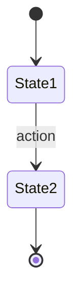
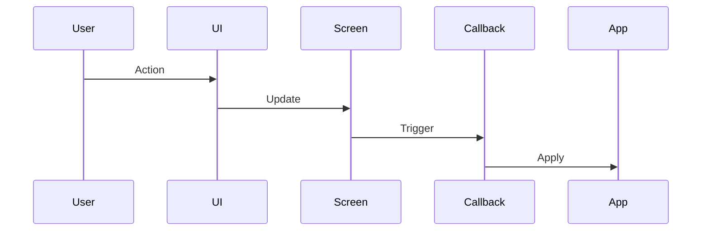
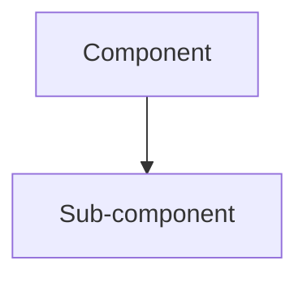

# Settings Context Map - Documentation Index

**Created:** 2026-02-16  
**Purpose:** Complete mapping of all settings screens, functionality, and interactions

## 📚 Documentation Structure

```
settings-context-map/
├── README.md                          # Overview and quick reference
├── INDEX.md                           # This file - navigation guide
├── COMPLETE-REFERENCE.md              # Comprehensive reference guide
├── 00-architecture.md                 # System architecture and design
├── state-management.md                # State management deep dive
├── navigation-flow.md                 # Navigation patterns and shortcuts
│
├── 01-ai-config/                      # AI Configuration Screens
│   ├── model-settings.md              # ✅ Model & Provider (2149 lines)
│   ├── system-prompts.md              # 🚧 System Prompts
│   ├── agents.md                      # 🚧 Agents
│   ├── agent-profiles.md              # 🚧 Agent Profiles
│   └── compaction.md                  # 🚧 Compaction
│
├── 02-tools-integrations/             # Tools & Integration Screens
│   ├── mcp-settings.md                # 🚧 MCP & Tools
│   ├── hooks.md                       # 🚧 Hooks
│   ├── skills.md                      # 🚧 Skills
│   ├── plugins.md                     # 🚧 Plugins
│   └── context-sources.md             # 🚧 Context Sources
│
├── 03-appearance/                     # Appearance Screens
│   └── display-settings.md            # ✅ Display (520 lines)
│
├── 04-security-auth/                  # Security & Authentication Screens
│   ├── security-settings.md           # ✅ Security & Permissions (1039 lines)
│   ├── authentication.md              # 🚧 Authentication
│   ├── cloud.md                       # 🚧 Cloud
│   └── proxies.md                     # 🚧 Proxies
│
├── 05-performance/                    # Performance Screens
│   ├── cache-statistics.md            # 🚧 Cache Statistics
│   └── reliability.md                 # 🚧 Reliability
│
└── 06-advanced/                       # Advanced Screens
    ├── general.md                     # 🚧 General
    ├── config-bundles.md              # 🚧 Config Bundles
    └── advanced.md                    # 🚧 Advanced
```

**Legend:**
- ✅ Complete documentation
- 🚧 Planned/In progress

## 🎯 Quick Access by Task

### I want to understand...

| Topic | Document | Section |
|-------|----------|---------|
| Overall system design | `00-architecture.md` | System Architecture |
| How state is managed | `state-management.md` | State Structure |
| Navigation patterns | `navigation-flow.md` | Navigation Flow |
| All settings at once | `COMPLETE-REFERENCE.md` | Complete Screen Inventory |
| How to add a screen | `COMPLETE-REFERENCE.md` | Development Guide |

### I want to configure...

| Feature | Screen | Document |
|---------|--------|----------|
| AI model selection | Model & Provider | `01-ai-config/model-settings.md` |
| UI appearance | Display | `03-appearance/display-settings.md` |
| Tool permissions | Security | `04-security-auth/security-settings.md` |
| MCP servers | Tools and MCP | `02-tools-integrations/mcp-settings.md` (planned) |
| Custom agents | Agents | `01-ai-config/agents.md` (planned) |
| System prompts | System Prompts | `01-ai-config/system-prompts.md` (planned) |
| Event hooks | Hooks | `02-tools-integrations/hooks.md` (planned) |
| Context loading | Context Sources | `02-tools-integrations/context-sources.md` (planned) |

## 📖 Reading Order

### For New Users
1. `README.md` - Overview
2. `03-appearance/display-settings.md` - Simple screen example
3. `01-ai-config/model-settings.md` - Complex screen example
4. `navigation-flow.md` - Learn navigation
5. `COMPLETE-REFERENCE.md` - Complete reference

### For Developers
1. `00-architecture.md` - System design
2. `state-management.md` - State patterns
3. `01-ai-config/model-settings.md` - Complex implementation
4. `04-security-auth/security-settings.md` - Tab-based UI
5. `COMPLETE-REFERENCE.md` - Development guide

### For Power Users
1. `navigation-flow.md` - Master shortcuts
2. `COMPLETE-REFERENCE.md` - All features
3. Screen-specific docs as needed

## 📊 Documentation Statistics

### Completed Documentation
- **Core Docs:** 4 files (Architecture, State, Navigation, Complete Reference)
- **Screen Docs:** 3 files (Model, Display, Security)
- **Total Lines:** ~2,500+ lines of documentation
- **Code Coverage:** 3 major screens fully documented

### Coverage by Screen
- ✅ Model & Provider - 100% documented
- ✅ Display - 100% documented  
- ✅ Security - 100% documented
- 🚧 All others - Architecture documented, details pending

## 🔍 Key Concepts

### State Management
**Document:** `state-management.md`

- Centralized State struct (373 lines)
- Per-screen state isolation
- State validation and boundaries
- State patterns (list, form, split panel, multi-state)

### Navigation
**Document:** `navigation-flow.md`

- Focus management (Sidebar vs Content)
- Keyboard shortcuts (global and screen-specific)
- Mouse support
- Form navigation patterns

### Screen Patterns
**Document:** `00-architecture.md`

1. Simple List - Display, General
2. Tabbed List - Security, Model browse
3. Split Panel - MCP, Hooks
4. Form - Agents, System Prompts
5. Action Menu - CRUD operations
6. Browser with Detail - Skills, Plugins

### Configuration
**Document:** `COMPLETE-REFERENCE.md`

- Global config: `~/.config/swarmcode/`
- Project config: `.swarmcode/`
- Persistence patterns
- Config file formats

## 🛠️ Development Resources

### File Organization
```
internal/chat/settings/
├── Core (4 files)
│   ├── types.go                   # State definitions
│   ├── manager.go                 # Main manager
│   ├── manager_handlers.go        # Event routing
│   └── permissions_shared.go      # Utilities
│
├── Model (5 files)
│   ├── model.go                   # Main logic
│   ├── model_render.go            # Rendering
│   ├── model_render_forms.go      # Form rendering
│   ├── model_update.go            # Update handlers
│   └── model_helpers.go           # Utilities
│
├── MCP (4 files)
│   ├── mcp.go
│   ├── mcp_render.go
│   ├── mcp_servers.go
│   └── tool_tester.go
│
├── Agents (2 files)
│   ├── agents.go
│   └── agents_render.go
│
├── Agent Profiles (3 files)
│   ├── agent_profiles.go
│   ├── agent_profiles_ui.go
│   └── agent_profiles_types.go
│
├── ... (30 more files)
```

### Adding a Screen
**See:** `COMPLETE-REFERENCE.md` → Development Guide

Steps:
1. Create screen file
2. Add to types.go (state)
3. Register in manager.go
4. Implement Render()
5. Implement HandleKeyPress()
6. Add callbacks
7. Update handlers
8. Test thoroughly
9. Document

### Testing
**See:** `COMPLETE-REFERENCE.md` → Testing Checklist

- Navigation testing
- State validation
- Callback integration
- Visual regression
- Error handling

## 📝 Documentation Standards

### Screen Documentation Template

Each screen doc should include:
1. **Overview** - Purpose and capabilities
2. **Screen States** - All possible states
3. **State Flow Diagram** - Mermaid state machine
4. **UI Layout** - ASCII mockup
5. **Navigation** - Keyboard shortcuts table
6. **State Management** - Fields used
7. **Data Flow** - Mermaid sequence diagram
8. **Callbacks** - Integration points
9. **Configuration** - Persistence format
10. **Examples** - Common use cases

### Diagram Standards

**State Machines:**


**Data Flow:**


**Architecture:**


## 🔗 External References

### Code Locations
- Settings: `internal/chat/settings/`
- UI Components: `internal/ui/`
- SDK Tools: `sdk/tools/`
- Commands: `internal/chat/commands/`

### Related Documentation
- Main README: `../../README.md`
- AGENTS.md: `../../AGENTS.md`
- Contributing: `../../CONTRIBUTING.md`

### Key Source Files
- State: `types.go` (373 lines)
- Manager: `manager.go` (618 lines)
- Handlers: `manager_handlers.go` (1000+ lines)
- Model: `model.go` (2149 lines)
- Security: `security.go` (1039 lines)
- Display: `display.go` (520 lines)

## 🎓 Learning Path

### Beginner
1. Read README overview
2. Try Display settings (simplest)
3. Learn basic navigation
4. Explore Model settings
5. Understand state basics

### Intermediate
1. Study architecture
2. Learn state management
3. Explore complex screens (Security, MCP)
4. Understand callbacks
5. Review configuration files

### Advanced
1. Full state management guide
2. All screen implementations
3. Event handling patterns
4. Integration patterns
5. Development guide

## 🚀 Future Documentation

### Planned Screen Docs
- [ ] System Prompts
- [ ] Agents
- [ ] Agent Profiles
- [ ] Compaction
- [ ] MCP Settings
- [ ] Hooks
- [ ] Skills
- [ ] Plugins
- [ ] Context Sources
- [ ] Authentication
- [ ] Cloud
- [ ] Proxies
- [ ] Cache Statistics
- [ ] Reliability
- [ ] General
- [ ] Config Bundles
- [ ] Advanced

### Planned Guides
- [ ] Configuration Best Practices
- [ ] Screen Development Tutorial
- [ ] State Pattern Guide
- [ ] Callback Integration Guide
- [ ] Testing Guide
- [ ] Performance Optimization
- [ ] Accessibility Guide
- [ ] Troubleshooting Guide

### Planned Diagrams
- [ ] Complete state machine (all screens)
- [ ] Full callback flow
- [ ] Configuration hierarchy
- [ ] Event propagation
- [ ] Render pipeline

## 📞 Contact & Contribution

### Maintainers
- SwarmCode Team

### How to Contribute
1. Read existing docs
2. Follow documentation standards
3. Add Mermaid diagrams
4. Include examples
5. Submit PR with docs

### Feedback
- GitHub Issues for doc improvements
- Discord for questions
- PR for corrections

---

**Last Updated:** 2026-02-16  
**Version:** 1.0  
**Maintained by:** SwarmCode Team
