# Settings Navigation Flow

## Overview

This document maps all navigation paths, keyboard shortcuts, and interaction patterns across the settings system.

## Global Navigation

### Settings Entry/Exit

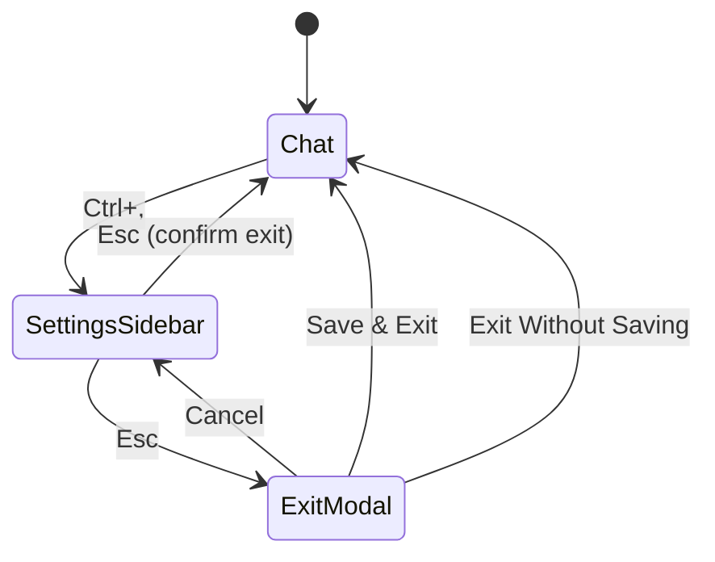

**Entry Points:**
- `Ctrl+,` from chat - Opens settings
- Command palette - "Settings"
- Menu selection

**Exit Confirmation:**
```
┌─────────────────────────────────────┐
│ Save Changes?                       │
├─────────────────────────────────────┤
│ ▶ Save & Exit                       │
│   Exit Without Saving               │
│   Cancel                            │
└─────────────────────────────────────┘
```

### Focus Management

Two focus states: **Sidebar** and **Content**

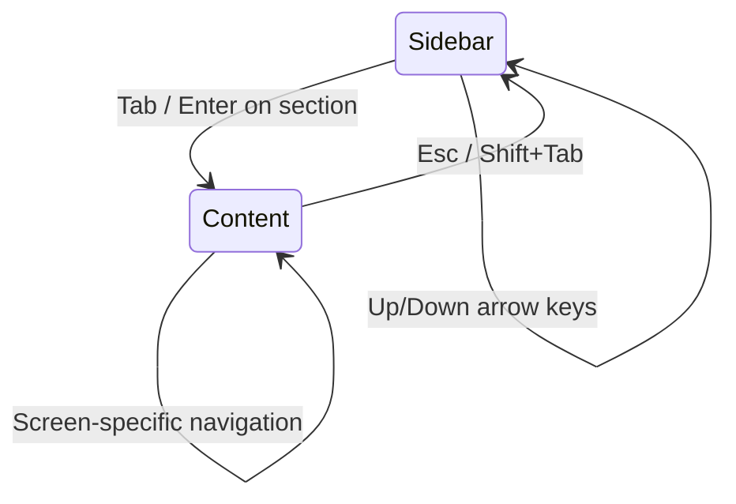

**Visual Indicators:**
- Sidebar focused: Border highlight on selected section
- Content focused: Primary-colored selection indicators

## Global Keyboard Shortcuts

| Key | Context | Action |
|-----|---------|--------|
| **Tab** | Any | Switch between Sidebar and Content |
| **Shift+Tab** | Content | Return to Sidebar |
| **Esc** | Any | Go back / Cancel / Exit |
| **Ctrl+,** | Chat | Open settings |
| **?** | Any | Show keyboard shortcuts help |
| **/** | Sidebar | Activate search |
| **Enter** | Sidebar | Navigate to section |
| **Up/Down** | Lists | Navigate items |
| **PgUp/PgDn** | Lists | Fast scroll |
| **Home/End** | Lists | Jump to start/end |

## Sidebar Navigation

### Section Groups

6 collapsible groups:
1. AI Config
2. Tools & Integrations
3. Appearance
4. Security & Auth
5. Performance
6. Advanced

### Keyboard Shortcuts

| Key | Action |
|-----|--------|
| **Up/Down** | Navigate sections |
| **Enter** | Open selected section |
| **/** | Start search |
| **Esc** (during search) | Clear search |
| **Click on group** | Toggle collapse |

### Search Functionality

**Activation:**
```
Press / → Search bar appears
Type query → Sections filter in real-time
Esc → Clear search, show all
```

**Matching:**
- Case-insensitive
- Matches section name, description, or group name
- Auto-expands matching groups

## Per-Screen Navigation

### Simple List Screens

**Screens:** Display, General, Auth, Cloud, Cache, Reliability

**Pattern:**
```
Up/Down → Navigate items
Enter/Space → Toggle/Activate
Esc → Exit to sidebar
```

### Complex Multi-State Screens

**Screens:** Model, Security, MCP, Agents, System Prompts, Hooks

**Pattern:**
```
Main View:
  Up/Down → Navigate
  Enter → Enter sub-screen
  Esc → Exit to sidebar

Sub-screen:
  Screen-specific navigation
  Esc → Return to main view
  
Form:
  Tab → Next field
  Shift+Tab → Previous field
  Enter → Submit
  Esc → Cancel
```

## Screen-Specific Navigation

### Model & Provider Settings

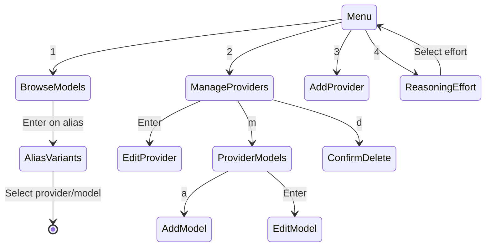

**Shortcuts:**
| Key | Context | Action |
|-----|---------|--------|
| 1-4 | Menu | Quick menu selection |
| Tab/Shift+Tab | Browse | Cycle filter tabs |
| / | Browse | Search models |
| f | Browse | Toggle favorite |
| r | Manage (OpenRouter) | Refresh models |
| m | Manage | View models |
| d | Manage/Models | Delete item |
| a | Provider Models | Add model |
| Left/Right | Reasoning Effort | Change effort |

### Security & Permissions

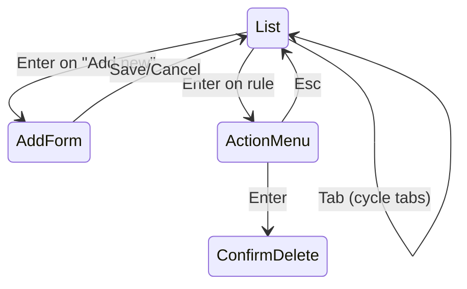

**Shortcuts:**
| Key | Context | Action |
|-----|---------|--------|
| Tab | List | Cycle permission tabs |
| Enter | List | Add new or edit rule |
| Left/Right | Add Form (Tool field) | Cycle tools |
| Type | Add Form (Pattern) | Enter pattern |
| Esc | Form/Menu | Cancel |

### MCP Settings

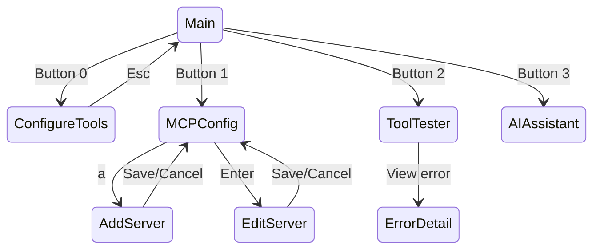

**Shortcuts:**
| Key | Context | Action |
|-----|---------|--------|
| Tab | Main | Cycle buttons |
| 1-4 | Main | Quick button selection |
| Left/Right | Main | Switch panels |
| Enter | Tool | Toggle enable/disable |
| c | ConfigureTools | Toggle categorized view |
| a | MCP Config | Add server |
| e | MCP Config | Edit server |
| d | MCP Config | Delete server |
| t | MCP Config | Test server |

### System Prompts

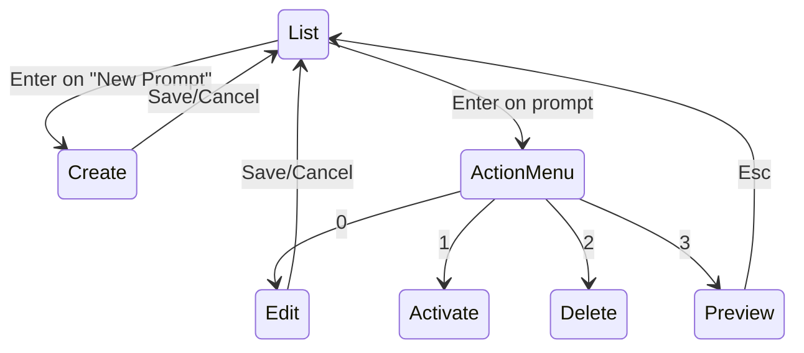

**Shortcuts:**
| Key | Context | Action |
|-----|---------|--------|
| Enter | List | Create new or action menu |
| 0-3 | Action Menu | Quick selection |
| Tab | Form | Next field |
| Ctrl+Enter | Form (Content) | New line |
| Esc | Any | Cancel/Back |

### Hooks

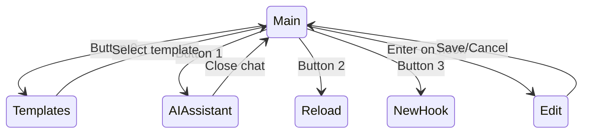

**Panel Navigation:**
```
Left/Right → Switch between Global and Project panels
Up/Down → Navigate within panel
Enter → Edit selected hook
```

**Shortcuts:**
| Key | Context | Action |
|-----|---------|--------|
| Tab | Main | Cycle buttons |
| Left/Right | Main | Switch panels |
| Enter | Hook | Edit hook |
| t | Main | Templates |
| n | Main | New hook |
| r | Main | Reload hooks |
| d | Hook selected | Delete |

### Context Sources

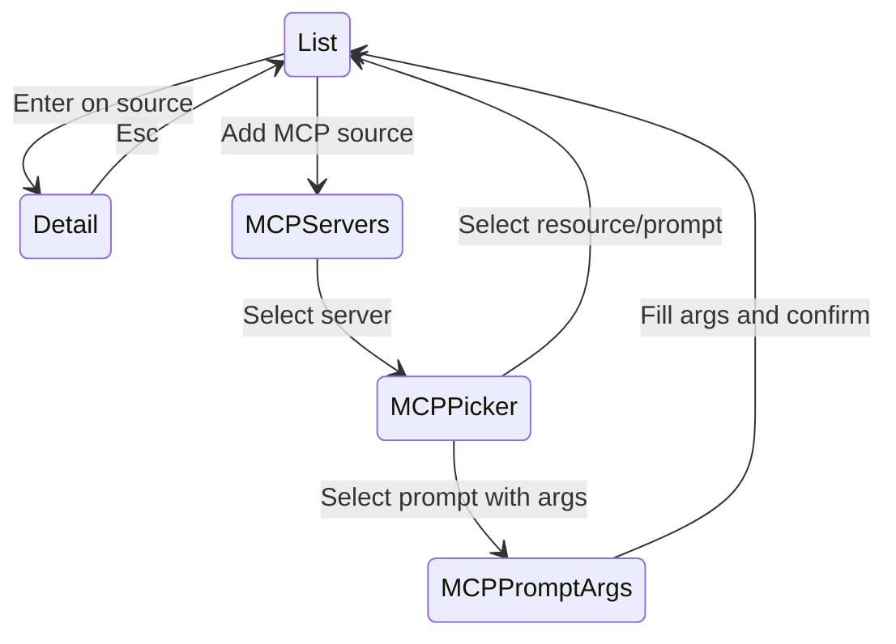

**Shortcuts:**
| Key | Context | Action |
|-----|---------|--------|
| Enter | List | View details |
| a | List | Add MCP source |
| e | Detail | Edit TTL |
| d | Detail | Delete source |
| Tab | MCP Picker | Switch tabs (Resources/Prompts) |
| / | MCP Picker | Search filter |

### Agents

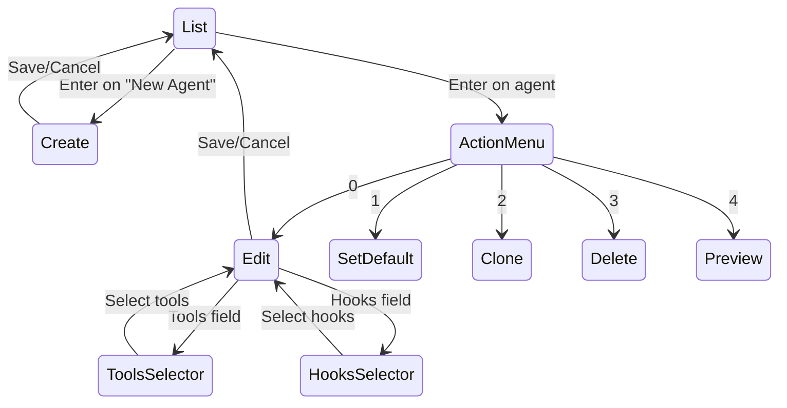

**Shortcuts:**
| Key | Context | Action |
|-----|---------|--------|
| Enter | List | New or action menu |
| Tab | Form | Next field |
| Space | Tools/Hooks | Toggle selection |
| / | Tools/Hooks | Search filter |
| Esc | Any | Cancel/Back |

### Agent Profiles

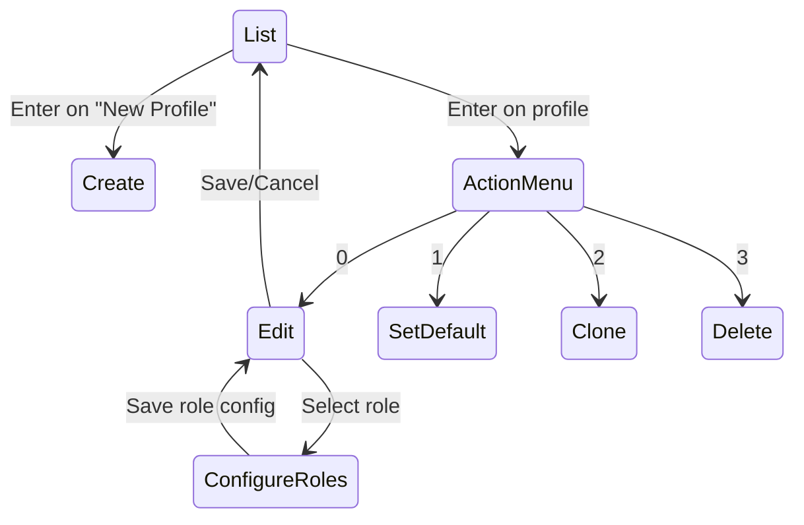

**Shortcuts:**
| Key | Context | Action |
|-----|---------|--------|
| Enter | List | New or action menu |
| Tab | Form | Next field |
| Enter | Role field | Configure role model |
| Esc | Any | Cancel/Back |

### Skills

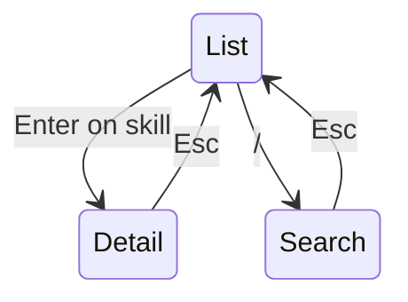

**Shortcuts:**
| Key | Context | Action |
|-----|---------|--------|
| Enter | List | View details |
| / | List | Search skills |
| Tab | Detail | Cycle tabs (Info/Scripts/Refs) |
| i | Detail | Install skill |
| u | Detail | Uninstall skill |

### Plugins

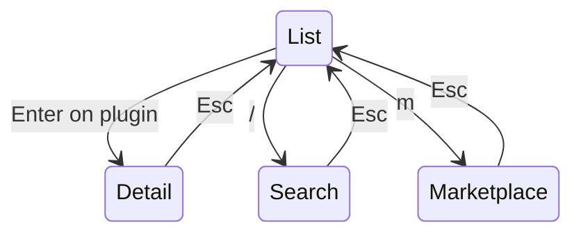

**Shortcuts:**
| Key | Context | Action |
|-----|---------|--------|
| Enter | List | View details |
| / | List | Search plugins |
| m | List | Browse marketplace |
| Tab | Detail | Cycle tabs |
| i | Detail | Install plugin |
| u | Detail | Uninstall plugin |
| e | Detail | Enable plugin |
| d | Detail | Disable plugin |

## Form Navigation Patterns

### Standard Form

**Fields:** Name, Description, Config options, Save button

**Navigation:**
```
Tab → Next field
Shift+Tab → Previous field
Enter → Start editing (text fields) or activate (buttons)
Esc → Cancel editing and return
```

**Text Editing:**
```
Type → Insert characters
Backspace → Delete character
Left/Right → Move cursor
Ctrl+A → Select all (not implemented)
Ctrl+C → Copy (terminal shortcut)
Ctrl+V → Paste (terminal shortcut)
```

### Multi-line Text

**Used by:** System Prompts, Agents

**Navigation:**
```
Enter → New line
Ctrl+Enter → Save (submit form)
Backspace → Delete character/line
Up/Down → Move between lines (editing mode)
Esc → Exit editing mode
```

### Dropdown/Picker

**Used by:** Model selection, Provider type, Tool selection

**Navigation:**
```
Left/Right → Cycle options
Type → Search (some dropdowns)
Enter → Confirm selection
Esc → Cancel
```

### Toggle/Checkbox

**Used by:** Display settings, Feature flags

**Navigation:**
```
Enter/Space → Toggle
Visual: [ON] / [OFF]
```

### List Selector

**Used by:** Tools, Hooks, Tags

**Navigation:**
```
Up/Down → Navigate items
Space → Toggle selection
Enter → Confirm selections
/ → Search filter
Esc → Cancel
```

## Mouse Support

### Sidebar

- **Click section** - Navigate to section
- **Click group header** - Toggle collapse
- **Scroll wheel** - Scroll sections

### Content Area

- **Click item** - Select item
- **Double-click item** - Activate/Edit
- **Click button** - Activate button
- **Click text field** - Start editing, place cursor
- **Drag** - Select text (if supported)
- **Scroll wheel** - Scroll content

### Context Menu

Right-click support (limited):
- **Rules** - Show action menu
- **Servers** - Show server actions
- **Agents** - Show agent actions

## Touch/Trackpad Support

### Gestures

- **Two-finger scroll** - Scroll content
- **Pinch zoom** - Not supported (terminal limitation)
- **Three-finger swipe** - Not supported

## Accessibility

### Keyboard-Only Navigation

All functionality accessible via keyboard:
- No mouse required
- Logical tab order
- Clear focus indicators
- Consistent shortcuts

### Screen Reader Support

Limited support:
- Text content readable
- Button labels announced
- Form fields labeled
- Visual-only indicators (colors, icons) may not be conveyed

### High Contrast Mode

- Respects terminal color scheme
- Bold text for emphasis
- Border highlights for focus

## Tips & Best Practices

### 1. Learn Global Shortcuts

Master these for fast navigation:
- `Tab` - Switch focus
- `Esc` - Go back
- `Enter` - Select/Activate
- `Up/Down` - Navigate

### 2. Use Search

In large lists:
- Press `/` to search
- Type query
- Navigate filtered results

### 3. Keyboard > Mouse

For efficiency:
- Keyboard navigation is faster
- More shortcuts available
- Better terminal compatibility

### 4. Esc is Your Friend

Lost or confused?
- Press `Esc` repeatedly to back out
- Returns to known state (sidebar)
- Safe - won't save partial edits

### 5. Tab Navigation

In forms:
- `Tab` to move forward
- `Shift+Tab` to move backward
- Cycles through all fields

## Troubleshooting Navigation

### Issue: Keys Not Working

**Cause:** Focus on wrong panel

**Solution:** Press `Tab` to switch focus

### Issue: Can't Exit Screen

**Cause:** In editing mode or modal

**Solution:** Press `Esc` multiple times

### Issue: Lost in Sub-screens

**Cause:** Deep navigation stack

**Solution:** Hold `Esc` to back out to main menu

### Issue: Can't Select Item

**Cause:** Scrolled out of view

**Solution:** Use `Home` to jump to top, or scroll with `Up`

### Issue: Mouse Clicks Not Working

**Cause:** Terminal doesn't support mouse

**Solution:** Use keyboard navigation

## Future Navigation Enhancements

Planned improvements:
1. **Breadcrumb trail** - Show navigation path
2. **Back/Forward buttons** - Browser-style navigation
3. **Jump to section** - Ctrl+G with section picker
4. **Recent sections** - Quick access to recently visited
5. **Custom shortcuts** - User-configurable keybindings
6. **Vim keybindings** - hjkl navigation option
7. **Command palette** - Ctrl+P quick actions
8. **Navigation history** - Alt+Left/Right to navigate history